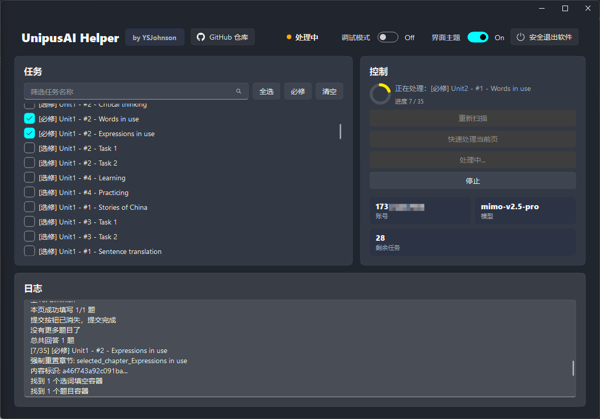
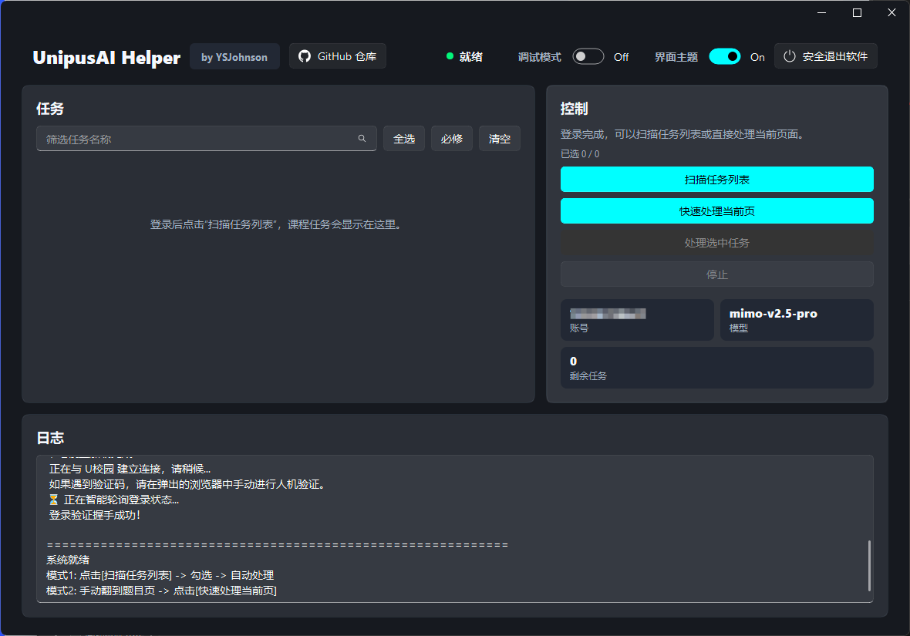
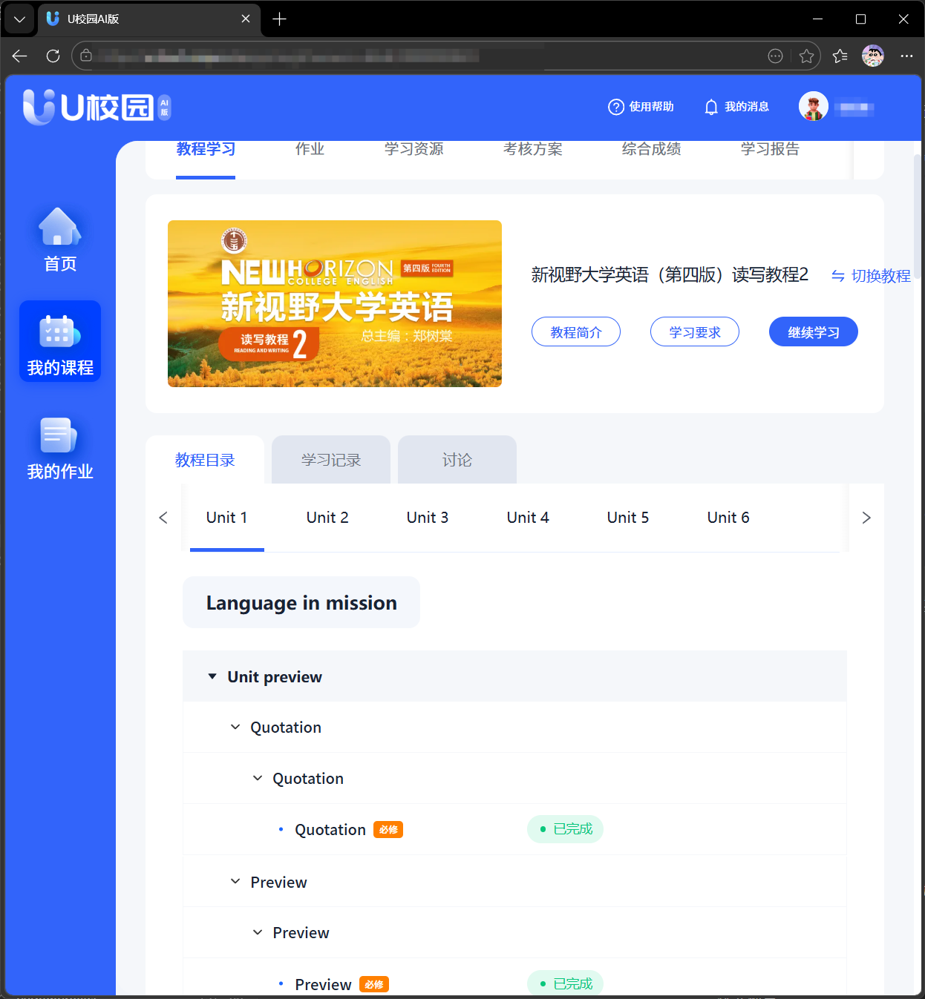
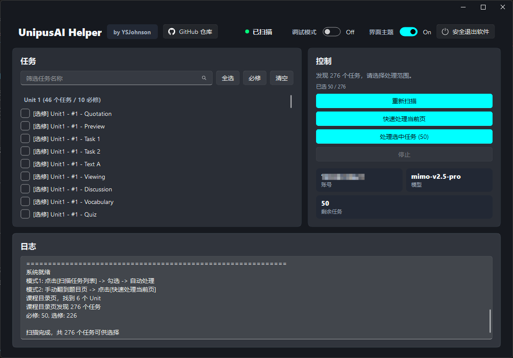
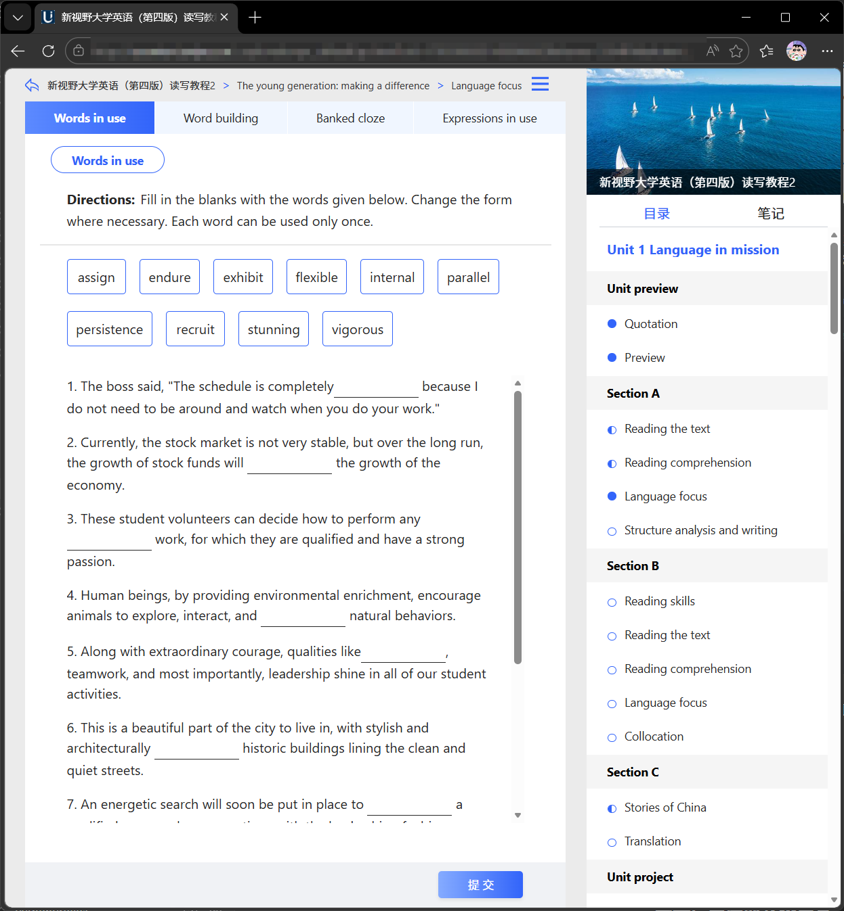
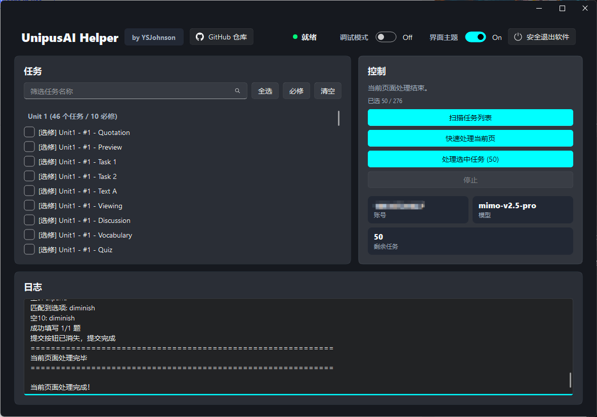
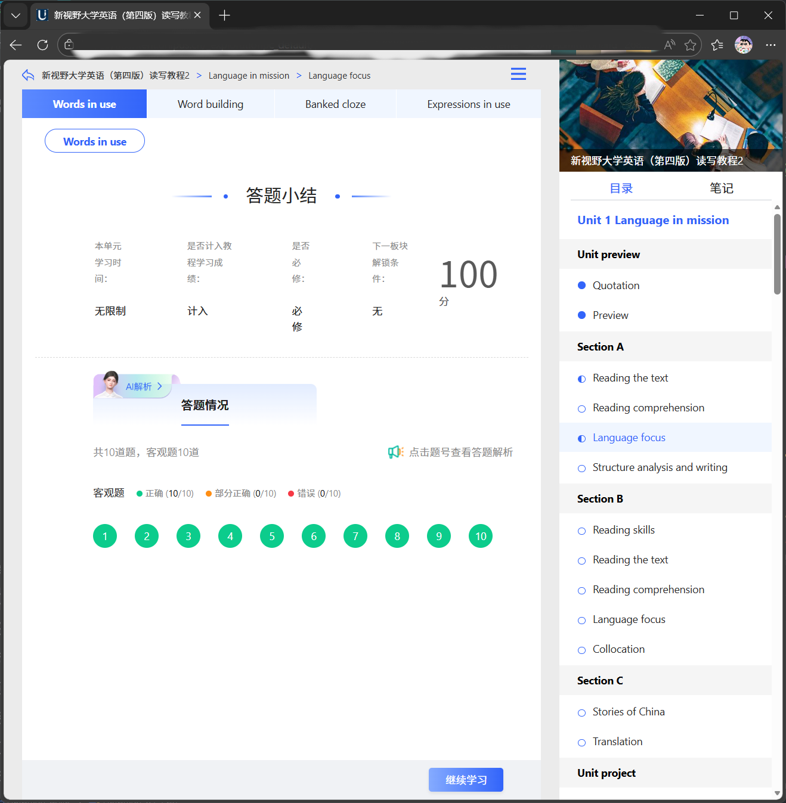

# UnipusAI-Helper

<p align="center">
  
</p>

<p align="center">
  基于 Selenium、Fluent UI 与 OpenAI 兼容接口的 U 校园 AI 版刷课工具
</p>

<p align="center">  
  
  
  
  
</p>

原 `UnipusAI_Plus` 项目已彻底重构为 `UnipusAI-Helper`。

## 简介

`UnipusAI-Helper` 是从早期 `UnipusAI_Plus` 重构而来的桌面版工具，当前版本为 `3.5.0`，主程序为 `main.py`，配置编辑器为 `config_editor.py`，界面为 Fluent 风格。项目重点在于更稳定的 GUI 体验、多任务的批量处理、单页面的手动处理。

内置**本地题库知识库**：做题时先查 `knowledge/` 下的离线答案库，命中就直接填本地答案，未命中的题继续交给大模型作答。

---

## 特性

- GUI 控制台：显示任务清单、运行状态、实时日志和调试开关。
- **本地题库知识库**：离线答案优先，减少大模型调用、提高答案准确率（见下方「本地题库知识库」）。
- 双模式处理：支持“扫描任务列表”批量处理，也支持“快速处理当前页”。
- 多题型处理：支持单选、多选、填空、写作、选词填空、拖拽排序、下拉选择、词汇测试、听力填空、听力选择、视频选择、视频任务、视频弹窗题、词汇闪卡、Self-check 词汇勾选、My voice 文字作答。
- 音视频辅助：支持本地 Whisper 转写。
- 环境检查：启动时检查 Edge、FFmpeg、网络和运行环境。
- 配置编辑器：提供独立 GUI 编辑器，减少手动修改 JSON 出错的概率。

---

## 本地题库知识库

`knowledge/` 目录是从公开答案文章转录整理的 Markdown 答案库，按「教材 → Unit → 小节 → 题号」组织：

```text
knowledge/
├── INDEX.md                        # 全量书目与转录状态
└── 新编大学英语（第四版）/
    ├── 新编大学英语 综合教程2.md
    └── 新编大学英语 综合教程3.md
```

### 工作方式

每道题在交给大模型之前，先按下面的顺序做本地检索：

1. **认教材**：优先用课程页 URL 的 `cid`（`course_map.py` 里人工核对的 cid→教材映射，事实级证据，会覆盖 config 里记着的旧教材）；未收录的 cid 再按 `knowledge_textbook` 配置、课程页 URL 里的教材代码（如 `nce_4_rw_3`）、页面标题与页头文字依次尝试识别。同一系列的不同分册（读写/视听说）不会互相串认；整页只写系列名、分不出是哪一本时宁可认不出、交给 AI。
2. **认小节**：用页面上的小节编号（如 `1-6`）、小节名（`Read and practice · Banked cloze`）和选词填空的词库来定位知识库里的对应小节。
3. **取答案**：按题号取答案，组装成与原流程完全一致的格式（选择题给字母、填空/选词给编号文本、简答给编号正文），交给原有的填写与提交逻辑。

命中的题直接填本地答案，**未命中的题仍然走原来的 AI 流程**，所以知识库只做「答案前置」，不改变任何填写与提交行为。

### 安全设计（宁可交回 AI，也不填错答案）

- **双证认节**：两级写法的教材要求页面名和任务名同时对上；`Section A` / `Section B` 的同名任务、跨 Unit 的整节同名，都必须靠 Section 名与 Unit 号拆开，拆不开就放弃。
- **Unit 号参与判定**：扫描任务时会带上 Unit 号；给不出 Unit（例如手工停在某一页用「快速处理当前页」）而候选小节又无法区分时，直接交回 AI。
- **选词填空先验明正身**：知识库有词库时与页面词库比对；没有词库时（新视野的转录未给出词库）反过来查「答案是否基本都来自页面词库」，两条都不成立就不用本地答案。
- **正文不当字母**：答案正文里出现的 a/b/c/d 不会被误当成选项字母（`bothered` 里的 b 不会被当成选项 B）。
- **散文转录不答题**：按答案就绪度自动排除「原文照录、答案是散文」的书，不让它参与作答。唯一例外：「浏览器核对收录」区里页面确认全对后收录的答案是已验证的，书不可作答时**只**尝试这些小节（收割闭环：第一次做对 → 收录 → 重做同题直接命中题库）。
- **收录用真实任务名**：收录进题库的小节名取页面「题目要求」（每次进同一页都一样），不再用带时间戳的一次性名字——否则下次永远匹配不上。
- **题目指纹**：收录时从页面题目文本里挑出最能代表这道题的实词（写成 `指纹：a | b | c` 一行）。重做同题时用它核对「这套答案就是这道题的」——同名同空数的小节靠指纹精确区分；两套指纹都对不上时照旧拒绝、交回 AI，绝不猜。
- **不确定就不填**：任何一步对不上，该题就交回 AI，并在日志里说明原因。

### 配置项

| 字段 | 默认 | 说明 |
| --- | --- | --- |
| `knowledge_enabled` | `true` | 是否启用本地题库知识库 |
| `knowledge_textbook` | `"auto"` | `auto` 为自动识别教材；也可直接写教材名（如 `新编大学英语 综合教程3`）来跳过识别 |
| `knowledge_min_confidence` | `"medium"` | 最低置信度门槛，可选 `low` / `medium` / `high`。`medium` 要求小节编号对上 |
| `knowledge_verify_wordbank` | `true` | 选词填空是否必须词库一致才用本地答案 |

在 `config_editor.py` 里可以直接改这几项，配置编辑器会列出当前 `knowledge/` 里实际存在的教材。

### 扩展答案库

知识库是纯 Markdown，一本书一个文件。程序支持两套小节写法。

**写法一（单级）**：`##` 就是完整小节名，下面直接列答案。小节名需与 U校园页面显示的逐字一致，这是命中率的根基。

```markdown
# <教材名> — Unit N <单元主题>

## 1-6 Read and practice · Banked cloze

词库：adequate / assigned / closing / …
1. finals
2. due
```

**写法二（两级）**：`##` 是页面、`###` 才是任务。适用于没有 `1-6` 编号的教材（如新视野大学英语）。

```markdown
# <教材名> — Unit N

## Section A · Reading comprehension

### Understanding the text

1) On the "offline days" …
2) The little devices change …
```

两级写法下，程序要求**页面名和任务名都对上**才认定这一节——因为 `Section A` 和 `Section B` 常有同名任务（如都有 `Understanding the text`），只看任务名会跨 Section 串答案；不同 Unit 之间整节同名更是常态，所以扫描到的 Unit 号也会参与判定，给不出 Unit 时会直接放弃、交回 AI。

把新的 `.md` 放进 `knowledge/<系列名>/` 即可被自动加载，无需改代码。

**不会被拿来答题的转录**：如果一本书是「教材原文逐页照录、答案是散文」（没有逐题编号），程序会按答案就绪度（含 ≥2 条编号答案的小节占比）自动把它排除在答题之外，只在日志里说明。这样即使把这类文件放进 `knowledge/`，也不会有人拿散文当答案去填。

> 当前已转录：《新编大学英语（第四版）综合教程 2、3》《新视野大学英语（第四版）读写教程 3》（可逐题作答），以及《新视野大学英语（第四版）视听说教程 3》（原文转录，不参与答题）。`knowledge/INDEX.md` 里其余教材目前只有答案来源链接，可按上述格式补录。

---

## 项目结构

```text
UnipusAI-Helper/
├── main.py
├── fluent_ui.py
├── config_editor.py
├── EnvironmentChecker.py
├── AudioRecognizer.py
├── knowledge_base.py           # 本地题库知识库检索
├── knowledge/                  # 答案库（Markdown，一书一文件）
│   ├── INDEX.md
│   └── 新编大学英语（第四版）/…
├── test_smoke.py
├── test_knowledge_base.py
├── config.json
├── requirements.txt
└── images/
```

---

## 运行环境

- Windows 10/11
- Python 3.8+
- Microsoft Edge
- FFmpeg
- OpenAI 兼容大模型接口

安装依赖：

```bash
pip install -r requirements.txt
```

---

## 使用方法

### 方式一：直接下载 Release（适合小白）

如果只是使用，不打算自己改代码，直接在 GitHub 的 `Releases` 页面下载打包好的主程序和配置编辑器即可。

1. 下载并解压发布包。
2. 运行配置编辑器并填写配置。
3. 启动主程序。

### 方式二：源码运行

```bash
git clone https://github.com/YSJohnson/UnipusAI-Helper.git
cd UnipusAI-Helper
pip install -r requirements.txt
python config_editor.py
python main.py
```

如需跳过环境检查：

```bash
python main.py --skip-check
```

---

## 配置说明

项目使用 `config.json` 作为本地配置文件，建议使用配置编辑器而不是手动修改。

```json
{
  "username": "",
  "password": "",
  "url": "https://uai.unipus.cn/sso/index.html?service=https%3A%2F%2Fucloud.unipus.cn%2Fhome",
  "api_key": "",
  "base_url": "",
  "model": "",
  "max_tokens": 8192,
  "temperature": 0.3,
  "token_full": "",
  "knowledge_enabled": true,
  "knowledge_textbook": "auto",
  "knowledge_min_confidence": "medium",
  "knowledge_verify_wordbank": true,
  "debug_mode": false
}
```

| 字段 | 说明 |
| --- | --- |
| `username` | U 校园 AI 版账号 |
| `password` | U 校园 AI 版密码 |
| `url` | 登录入口，默认即可 |
| `api_key` | 大模型接口密钥 |
| `base_url` | OpenAI 兼容接口地址 |
| `model` | 模型名称 |
| `max_tokens` | 最大 token 数，默认即可 |
| `temperature` | 生成温度，默认即可 |
| `token_full` | 浏览器本地存储中的 `__token`，用于绕过平台的反作弊系统 |
| `whisper_model` | 本地语音识别模型名：`base`（默认，快但易听错）/ `small`（更准，约慢 3 倍，听力题转写错字多时建议换） |
| `knowledge_enabled` | 是否启用本地题库知识库，默认 `true` |
| `knowledge_textbook` | `"auto"` 自动识别教材，也可写死教材名 |
| `knowledge_min_confidence` | 知识库最低置信度门槛：`low` / `medium` / `high` |
| `knowledge_verify_wordbank` | 选词填空是否必须词库一致才用本地答案，默认 `true` |
| `debug_mode` | 是否开启调试日志 |

> 脚本不限制大模型提供商，所以理论上所有支持 OpenAI 兼容接口的提供商都支持。目前测试过 DeepSeek、硅基流动、Kimi 兼容接口。
>
> 仓库里的 `config.example.json` 是空白模板（不含任何凭据），`config.json` 已被 `.gitignore` 排除，请勿把填了真实账号的配置提交到仓库。
>
> 另外：`config.json` 的备份/历史文件（`config.json.bak*`，如 `config.json.bak_keys`、`config.json.bak_swap`）同样含有明文账号、密码和 API Key，请勿打包分享、上传或提交到任何仓库；不再需要时请及时删除。

## 获取 `token_full`

1. 在浏览器中手动登录 U 校园 AI 版。
2. 打开 F12 开发者工具，进入 `Console` / `控制台`。
3. 输入并执行：

```javascript
localStorage.getItem('__token')
```

4. 将结果填写到配置文件的 `token_full`。

> [!IMPORTANT]
> 由于 token 的值必须是字符串类型，获取的 token_full 不能直接使用，你必须在所有内部的双引号前加反斜杠（`\`）进行转义，否则会破坏 JSON 的语法结构。如果使用配置编辑器 `config_editor.py` 保存配置，程序会自动处理 JSON 转义问题；如果手动编辑 `config.json`，需要特别注意这一点。

---

## 使用指南

1. 配置好基础信息，启动主程序并等待环境检查完成。
2. 程序会自动打开浏览器并执行登录流程。
3. 如果遇到验证码或人机验证，需要在浏览器中手动完成。
4. 系统就绪后，控制台显示系统就绪即为登录成功。



5. 先在浏览器点击 `我的课程` -> `选择你要刷的课程`，打开到展示教程目录的页面。



6. 可点击“扫描任务列表”，脚本会自动扫描所有单元所有任务并展示出来，你可以自行选择需要刷的任务，或一键选择所有必修任务。



7. 点击 `开始处理选中任务` 即可批量全自动处理选中任务。

8. 或者手动打开需要做的某一个页面，进入到题目页面，点击“快速处理当前页”，脚本则只做当前页面。



9. 做完后脚本会在延迟几秒后自动提交。  
这是为了模拟真人的思考时间，避免用时过短引起怀疑。  
控制台会提示当前页面处理完毕并自动提交作业。





---

## 题型适配投稿

我本身能接触到的教材有限 能适配的教材题型也有限 所以不能保证所有题型都适配
如果你遇到暂不支持的新题型 可以在 issue 中投稿页面结构 我会在有可复现材料时优先适配 也将会帮助项目变得更加完善。

在提交 issue 时 请尽量按照以下格式并提供以下内容 这会有利于我的适配：
1. 题型截图：直接截图整个页面即可。
2. 关键元素 HTML：在浏览器按下 F12 打开开发人员工具 在控制台粘贴以下内容 会自动获取当前页面的题型内容：

```javascript
(() => {
  const selectors = [
    '.layout-direction-container',
    '.abs-direction',
    '.layout-material-container',
    '.audio-material-wrapper',
    '.question-audio',
    'audio',
    '.layoutBody-container',
    '.question-common-abs-reply',
    '.question-common-abs-choice',
    '.question-wrap',
    '.question-basic'
  ];

  const data = {
    url: location.href,
    title: document.title,
    items: selectors.map(sel => ({
      selector: sel,
      count: document.querySelectorAll(sel).length,
      nodes: [...document.querySelectorAll(sel)].map((el, i) => ({
        index: i,
        text: (el.innerText || '').slice(0, 2000),
        html: el.outerHTML
      }))
    }))
  };

  copy(JSON.stringify(data, null, 2));
  console.log('已复制页面结构，可以直接粘贴给我');
})();
```
3. 将获取到的页面结构保存到 txt 文本文档中 并和图片一起作为 issue 附件上传

请注意隐私：

- 不要公开账号、密码、token、Cookie、API Key、学校个人信息。
- 如果截图里有姓名、学号等隐私信息，请注意打码。
- 音频、视频资源链接如果包含个人鉴权参数，也请先脱敏。

材料越完整，越容易适配；只有一句“这个题型不支持”的 issue 无法判断页面结构 将被作为无效 issue 关闭。

---

## 更新日志

### 2026-09-21（第二轮：接入第二批题库）

- 知识库新增《新视野大学英语（第四版）读写教程 3》全书 6 单元与《新视野大学英语（第四版）视听说教程 3》原文转录。
- 解析器支持第二套小节写法：`##` 页面 + `###` 任务（新视野的教材没有 `1-6` 编号）。
- 小节匹配升级为「页面名 + 任务名」双证，并接入 Unit 号：`Section A`/`Section B` 的同名任务、跨 Unit 的整节同名都能正确分开；区分不开时交回 AI 而不是猜。
- 选词填空校验增强：知识库没给词库时，改用「答案是否基本都来自页面词库」来验证归属。
- 新增答案就绪度判定：按「含 ≥2 条编号答案的小节占比」自动识别「原文照录、答案是散文」的转录，并把这类书排除在答题之外（视听说教程 3 就被自动排除），避免拿散文当答案。
- 排除 `转录自检` 等 meta 小节（里面也有 `1.` 编号但不是答案）。
- 忽略「词库：未在截图中提供」这类占位词库，避免词库校验被误导。
- 知识库测试从 17 个增至 41 个用例，覆盖上述全部安全性质。

### 2026-09-21（第一轮：接入本地题库）

- 新增本地题库知识库：做题前先检索 `knowledge/` 下的离线答案库，命中的题直接填本地答案，未命中的题继续交给大模型，原有作答与提交逻辑不变。
- 新增 `knowledge_base.py`：教材识别（配置 / 课程页教材代码 / 页面标题）、小节匹配（编号 + 小节名 + 词库）、按题型组装答案。
- 新增知识库安全策略：选词填空要求词库一致；同一编号下有多个小节且无法区分时拒绝使用本地答案；答案正文里的单个字母不会被误当选项。
- 新增配置项 `knowledge_enabled`、`knowledge_textbook`、`knowledge_min_confidence`、`knowledge_verify_wordbank`，并加入配置编辑器界面（含可用教材列表）。
- 新增 `test_knowledge_base.py`（17 个用例，覆盖命中与各类拒绝场景）。
- 打包脚本 `UnipusAI-Helper.spec` / `config_editor.spec` 会把 `knowledge/` 一并打包。
- `config.example.json` 恢复为不含任何凭据的空白模板。

### 2026-07-05

- 版本号更新至 `3.5.0`，窗口标题和界面版本标识改为读取统一版本常量。
- 新增听力选择题识别：支持带音频材料的单选/判断题，先转写音频再根据音频内容作答。
- 新增视频选择题识别：支持“观看视频后判断 True/False 或选择答案”的题型，先播放并转写主视频，再根据视频内容作答。
- 新增视频填空题识别：支持观看视频片段后填写段落空格，复用视频转写并按空格上下文作答。
- 新增拖拽排序题识别：支持音频材料后的 A/B/C/D 信息块排序题，按材料出现顺序生成字母序列并自动重排。
- 新增 Self-check 词汇勾选识别：支持词汇自检表，自动勾选 Got it 列，避免误点 Review 列。
- 新增 My voice 文字作答识别：支持录音/上传作品页，自动生成 500 字符以内英文介绍，填写文字框并生成 PDF 附件上传以满足提交校验。
- 移除 `whisper_api` 配置项：音视频转写固定使用本地 Whisper，不再在配置文件和配置编辑器中保留 Whisper API 输入。
- 优化多题流程：支持同一任务点内连续点击“下一题”处理多道题，最后一题再提交。
- 优化文本框填写：填写后会回读校验，常规输入未生效时自动用 JS 同步输入框状态，避免日志成功但页面仍为空。
- 优化多文本框简答：同一个题目容器内包含多个简答输入框时，会按编号逐个填写所有文本框。
- 优化按钮识别：兼容 `<a class="btn">下一题</a>`、`<a class="btn">上一题</a>` 和 `<a class="btn">提 交</a>`，避免把翻页按钮误当提交按钮。
- 优化答案提取：兼容 AI 返回 `简答题: 1... 简答题: 2...` 的格式，避免题型标签混入上一题答案。
- 优化填空答案提取：兼容 AI 返回 `空1:`、`Blank 1:` 等格式，填写时自动去掉空号前缀。
- 优化听力填空：提取每个空所在句子的左右上下文，并在填写前修剪明显重复或不合语法的短语，减少答案串位。
- 优化音视频预处理：视频题页面会跳过 Words & tips 等短音频，避免把词汇发音误当成题目音频。

---

## 常见问题 Q&A

### 知识库一直没命中，全部交给 AI 了

按日志里的 `[知识库]` 行逐条排查：

- `未识别出教材`：课程页上认不出用的是哪本书。在 `config_editor.py` 里把「教材」一栏从 `auto` 改成具体教材名（编辑器会列出 `knowledge/` 里已有的教材）。
- `未匹配到小节` 或 `候选小节无法区分`：页面上的小节编号/名称与知识库对不上，或同名小节之间无法区分（`Section A` 与 `Section B` 的同名任务、不同 Unit 的整节同名）。这说明该教材的这一节还没转录或转录格式与页面不一致，或没拿到 Unit 号。此时交回 AI 是预期行为，不是故障。
- 日志里出现「不参与答案检索」：那本书的转录是教材原文逐页照录、答案是散文，程序中就不拿它逐题作答了。
- `该小节无词库` / `词库不符`：选词填空题对上了错误的候选小节，程序主动放弃以免填错，会交回 AI。
- 那本书本身不在 `knowledge/` 里：按上文「扩展答案库」补录后即可生效。

### 知识库的答案是错的怎么办

直接改 `knowledge/<系列名>/<教材名>.md` 里对应的那一行即可，不需要改代码——检索是按题号取那一行的内容。改完可以跑 `python test_knowledge_base.py` 确认解析正常。

> 注意：测试里包含对部分答案的逐字期望（例如 `test_smoke.py` 里的 `EXPECTED_REAL_KB_ANSWERS`，以及 `test_knowledge_base.py` 中若干直接写死的答案文本）。如果你改动的正是被这些用例覆盖的答案内容，需要同步更新测试里的期望值，否则测试会失败——这不代表解析坏了。

### 找不到 FFmpeg

- 听力和视频转写依赖 FFmpeg，需要安装并加入系统 `PATH`。

### 登录后白屏或状态异常

- 通常是 `token_full` 过期或格式错误，需要重新获取并更新。

### API 调用失败

- 优先检查：
- `api_key`
- `base_url`
- `model`


其他问题欢迎在 Issue 提出。

---

## 致谢

感谢优秀的开源土壤。感谢 [UnipusAI](https://github.com/Zzj-klwgxdz/UnipusAI) 项目作者：Zzj-klwgxdz。  
感谢原作者提供的强大解析器框架与思路，特别是其针对 U 校园 AI 版的反作弊绕过机制。

---

## License

本项目采用 **GNU Affero General Public License v3.0 (AGPLv3)**。  
你可以自由使用、修改和分发本项目，但任何修改版或衍生作品必须以相同的 AGPLv3 协议开源。即使是作为网络服务运行（SaaS），也必须向用户公开完整的源代码。

> [!WARNING]
> 本项目仅用于 Python 自动化、Web 页面交互、语音识别与大模型接口接入的学习研究。请遵守学校、课程平台和相关法律法规，不要将其用于违反平台规则或影响教学公平的用途。
